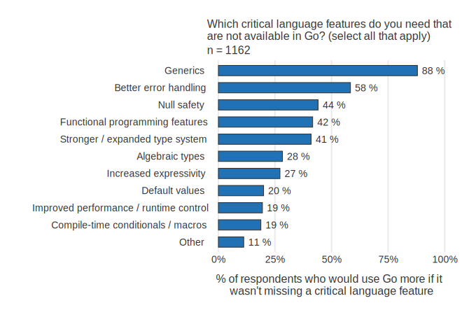
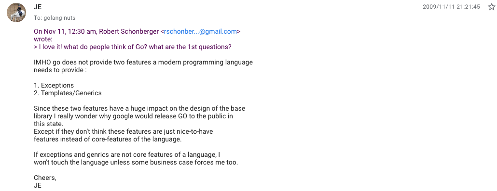

# go-1.18-sample

## 1.18環境構築

### 1. コンテナ立ち上げ

  ```sh
  git pull
  docker-compose -f docker-compose.learning.yml up -d --build
  ```

### 2. アタッチ

  VSCodeの人はコンテナ名：`go-118-sample_dev-go-beta`をアタッチする。
  CLI勢の人は`docker exec -it go-118-sample_dev-go-beta bash`でコンテナに入る

### 3. install, 実行

1. VSCodeの人は拡張機能にて、検索欄に`@recommended`を入力し、全てインストール
2. `make install-grpc`を実行
3. コンテナ内で`go run /repo/1.18/01-add/main.go`を実行し、エラーなく終了すれば成功

## 1.18 アップデート内容

約半年に一度のお祭りイベントであるGoのアップデートが3月に迫ってきた！
特に今回のアップデートは多くのGopherが待ち望んでいたGenericsが遂に登場する！（[2020年アンケート](https://go.dev/blog/survey2020-results)ではGoに必要な機能として1位にランクイン）


## Go1.18の主な新機能

- Generics
  - 型パラメータの導入
- Fuzzing
  - 潜在的なバグ・脆弱性によるpanicの検知
- Workspace Mode
  - 複数のGo Module（go.mod, go.sum）を単一Repogitoryにで管理しやすくなる`go work`コマンドの登場
- その他：<https://tip.golang.org/doc/go1.18>

## Generics

Goが発表された次の日に、Genericsが無いことが指摘されている。

<https://groups.google.com/g/golang-nuts/c/70-pdwUUrbI/m/onMsQspcljcJ>

それでも導入に時間がかかった理由は？

- Goの開発はユーザーの意見を取り入れ、Proposalとしてドキュメントをしっかり書く文化があり、かなり丁寧に行われている。
  - GoのGenericsには膨大な案が出されている。（<https://github.com/golang/go/wiki/Go2GenericsFeedback#supplemental-supporting-with-modifications>）
  - 本来Genericsは1.17で導入される予定だった。
  - 1.18も本来2月リリース予定だった。
- GoはBetter Cとも呼ばれ、Cに慣れていた人にはGenericsが無いことにあまり違和感がなかった。
- Goを開発した4人の内の1人であるRob Pike氏は「Goは機能の豊富さで競争するということはしない」と明言している。（<https://go.googlesource.com/proposal/+/master/design/draft-fuzzing.md>）

## Fuzzing

[Proposalより](<https://www.veriserve.co.jp/service/detail/fuzzing.html>  )
> Fuzzing is a type of automated testing which continuously manipulates inputs to a program to find issues such as panics, bugs, or data races to which the code may be susceptible

> ファジングは、プログラムへの入力を継続的に操作して、コードが影響を受けやすいパニック、バグ、データ競合などの問題を見つける自動テストの一種です。

- [go-fuzz](https://github.com/dvyukov/go-fuzz)などのサードパーティ製のpackageは存在していて、[標準packageなどのバグ検知に多大な実績](https://github.com/dvyukov/go-fuzz#trophies)を残している。
[Proposalより](<https://go.googlesource.com/proposal/+/master/design/draft-fuzzing.md#rationale>)
> In the long term, this design could start to replace existing table tests, seamlessly integrating into the existing Go testing ecosystem.

>長期的には、この設計は既存のテーブルテストに取って代わり、既存のGoテストエコシステムにシームレスに統合される可能性があります。

## Workspace Mode

- 単一リポジトリで全コードを管理することをMonorepoという。コードが見やすかったり、リリースを管理しやすいといったメリットがある。
- [メルカリShopsはMonorepoで開発されている](https://engineering.mercari.com/blog/entry/20210817-8f561697cc/)
- 1.17までは1つのGit Repogitoryで複数のGo Moduleを管理する場合、警告を消す設定が必要だったり、Packageの管理が面倒だった

## 参考文献

- <https://docs.google.com/presentation/d/1TqCv_ECXBVGw1XOQ-v6rVRyiYGczl4yhDCJIhNLpzaQ/edit#slide=id.g80ffbfd5e3_0_168>
- <https://zenn.dev/mattn/books/4c7de85ec42cb44cf285>
- <https://www.youtube.com/watch?v=omvbKgQrdYU>
